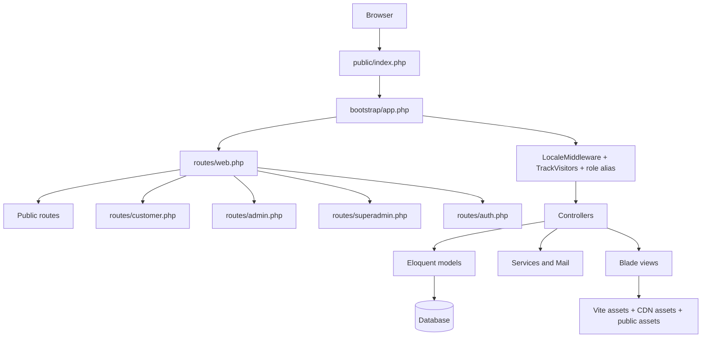
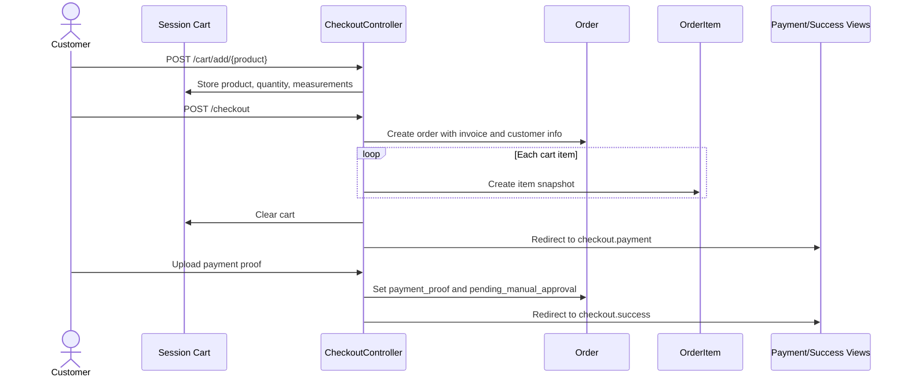
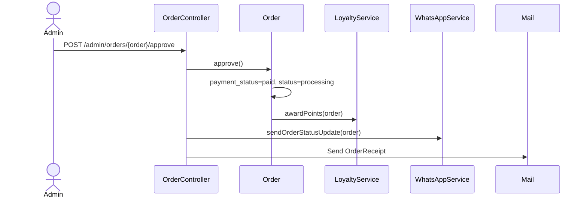

# Architecture

## High-Level Shape

This is a conventional Laravel application with a public storefront, authenticated customer flows, admin operations, and superadmin controls. The implementation uses Laravel 13, Eloquent, Blade, Breeze-style auth controllers, Tailwind/Vite, Alpine.js, Telescope, Laravel Scout traits on searchable models, and Midtrans/Fonnte-related integration code.

The main request pipeline is:

1. `bootstrap/app.php` configures web routing through `routes/web.php`.
2. `routes/web.php` defines public routes and requires `customer.php`, `admin.php`, `superadmin.php`, and `auth.php`.
3. Global middleware applies locale selection and visitor tracking.
4. Role-protected route groups call controllers.
5. Controllers query Eloquent models and return Blade views.
6. Views use Tailwind utility classes, Alpine interactions, Font Awesome icons, AOS animations, CMS values from `SiteSetting`, and lightweight click analytics.

## Application Layers

| Layer | Location | Responsibility |
| --- | --- | --- |
| Bootstrap | `bootstrap/app.php`, `bootstrap/providers.php` | Routing, middleware registration, provider registration, CSRF exceptions. |
| Routes | `routes/*.php` | Public/customer/admin/superadmin/auth route definitions. |
| Controllers | `app/Http/Controllers` | Request validation, workflow orchestration, Eloquent queries, view responses. |
| Requests | `app/Http/Requests` | Reusable validation for login and profile updates. |
| Middleware | `app/Http/Middleware` | Locale selection, role authorization, visitor tracking. |
| Models | `app/Models` | Eloquent persistence, relationships, casts, small domain methods. |
| Services | `app/Services` | Loyalty point changes and WhatsApp/Fonnte messaging. |
| Mail | `app/Mail` | Order receipt email. |
| Views | `resources/views` | Public pages, dashboards, auth screens, emails, errors, reusable components. |
| Frontend assets | `resources/css`, `resources/js`, `vite.config.js`, `tailwind.config.js` | Tailwind component classes, Alpine bootstrapping, Axios defaults, Vite compilation. |
| Database | `database/migrations`, `database/seeders`, `database/factories` | Schema, seed/demo data, user factory. |
| Config | `config/*.php` | Laravel config plus `midtrans.php`, service keys, filesystem, queue/session/cache setup. |
| Public assets | `public` | Entry point, built assets, Filament/Telescope published assets, brand/product images. |

## Request Flow

## Major Modules

### Storefront

Implemented by `HomeController`, `BlogController`, `FeedController`, `CheckoutController`, `AnalyticsController`, and public Blade views. It supports product listing/search/filter/sort, product detail pages, blog index/detail, order tracking, language switching, product RSS feed, and click analytics.

### Customer

Implemented by `CartController`, `CheckoutController`, `ProfileController`, and `DashboardController::user`. The cart is session-backed. Checkout writes `orders` and `order_items`, then redirects to manual payment instructions and proof upload.

### Admin

Implemented under `App\Http\Controllers\Admin` plus shared `CMSController`, `DashboardController`, and `Superadmin\SiteSettingController` for settings and promo management. Admin users can manage catalog data, order status/payment approval, production stages, measurements, blogs, CMS content, settings, promo/popup content, analytics, and reports.

### Superadmin

Implemented under `App\Http\Controllers\Superadmin` and shared reporting/controllers. Superadmins can access all admin-style reports plus staff management, customer list/export, SEO/settings, CMS, promo/popup management, analytics, and a higher-level dashboard.

## Middleware and Cross-Cutting Concerns

- `LocaleMiddleware` sets the app locale from session `locale`; otherwise it reads `SiteSetting::get('default_language', 'id')`.
- `TrackVisitors` appends globally and records guest, non-JSON GET requests in `visitors`.
- `RoleMiddleware` checks the authenticated user's `role` string against allowed route parameters.
- `AppServiceProvider` sets a custom pagination view and dynamically overrides `config('app.name')` from `site_settings.site_name` when the table exists.
- `TelescopeServiceProvider` filters non-local entries and defines a `viewTelescope` gate with an empty allowlist.

## Data Flow: Checkout

## Data Flow: Admin Order Approval

