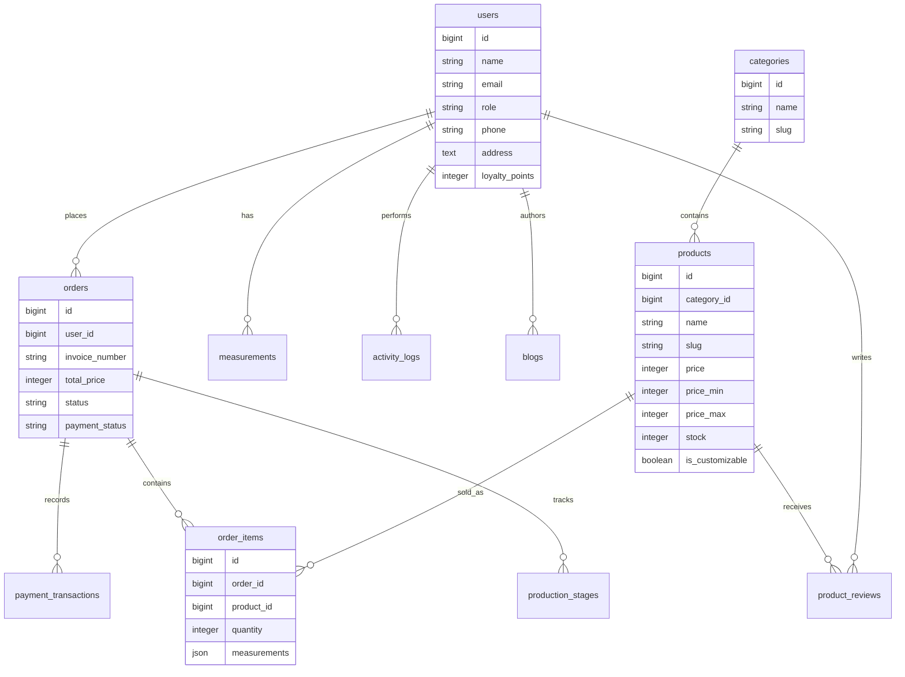

# Database Structure

The database schema is defined in `database/migrations`. The default `.env.example` uses SQLite, while Laravel config supports other drivers through standard `DB_*` variables.

## Entity Relationship Diagram

## Tables

### `users`

Stores authenticated accounts and customer profile/shipping details.

Key columns: `name`, `email` unique, `password`, `role`, `phone`, `address`, `province_id`, `city_id`, `postal_code`, `loyalty_points`.

Roles are strings: `user`, `admin`, `superadmin`.

### `categories`

Product categories.

Key columns: `name`, `slug` unique, `image_url`, `description`, SEO fields.

The `Category` model marks the category content and SEO columns fillable.

### `products`

Catalog products.

Key columns: `category_id`, `name`, `slug` unique, `description`, `price`, `price_min`, `price_max`, `stock`, `is_customizable`, `weight`, `image_url`, `rating`, `sales_count`, `view_count`, SEO fields.

`category_id` cascades on category deletion.

`price` remains the transaction price used by cart and checkout. `price_min` and `price_max` drive storefront estimate labels such as `Rp50.000 - Rp100.000`.

### `blogs`

Blog content with Indonesian and English fields.

Key columns: `author_id`, `title`, `title_en`, `slug`, `excerpt`, `excerpt_en`, `content`, `content_en`, `image`, `views`, `status`, `published_at`, SEO fields.

Public model accessors return English fields when locale is `en`, except for admin/superadmin request paths.

### `orders`

Customer order header.

Key columns: `user_id` nullable, `invoice_number`, customer contact/address snapshot, `total_price`, `shipping_cost`, `status`, `payment_status`, `order_status`, `payment_method`, `courier`, `tracking_number`, `notes`, `snap_token`, `payment_proof`, timestamps for paid/shipped/completed.

`user_id` is nullable and uses `onDelete('set null')`.

### `order_items`

Order item snapshots.

Key columns: `order_id`, `product_id` nullable, `product_name`, `product_price`, `quantity`, `measurements` JSON, `price`, `subtotal`.

Items preserve product name/price even when the product record is later deleted.

### `site_settings`

CMS, integration, localization, brand, payment, and logistics settings.

Key columns: `key` unique, `value`, `type`, `group`.

The model reads both raw scalar strings and legacy JSON-encoded values. `SiteSetting::set()` stores scalar values as strings and arrays/objects as JSON.

Promo display settings use keys such as `promo_enabled`, `promo_label`, `promo_original_price`, `promo_real_price`, and `promo_description`. The initial storefront modal uses `promo_popup_enabled`, `promo_popup_title`, `promo_popup_message`, `promo_popup_cta_label`, `promo_popup_cta_url`, `notification_enabled`, `notification_title`, and `notification_message`.

SEO and tracking settings include `site_description`, `site_keywords`, `seo_meta_author`, `seo_meta_robots`, `seo_canonical_url`, `seo_og_title`, `seo_og_description`, `seo_og_image`, `seo_og_type`, `seo_twitter_card`, `seo_twitter_site`, `google_tag_manager_id`, `google_analytics_id`, `google_ads_tag_id`, `google_site_verification`, `facebook_domain_verification`, and `analytics_average_position`.

### `measurements`

Customer body measurements.

Key columns: `user_id`, `chest`, `waist`, `hip`, `shoulder`, `sleeve_length`, `body_length`, `notes`.

`user_id` cascades on user deletion.

### `product_reviews`

Product reviews by users.

Key columns: `user_id`, `product_id`, `rating`, `review`.

The schema/model exists, but no controller/routes were found for creating or displaying reviews.

### `production_stages`

Manual production timeline for orders.

Key columns: `order_id`, `stage`, `notes`, `started_at`, `completed_at`.

Allowed stages in the migration: `Pending`, `Fabric Preparation`, `Cutting`, `Sewing`, `Finishing`, `Quality Control`, `Packaging`, `Shipping`.

### `payment_transactions`

Payment transaction records.

Key columns: `order_id`, `transaction_id`, `payment_type`, `transaction_status`, `gross_amount`, `payload`, `paid_at`.

The model exists, but current checkout uses manual bank transfer proof uploads and does not create payment transactions.

### `activity_logs`

Generic activity log table.

Key columns: `user_id`, `action`, `description`, `subject_type`, `subject_id`, `ip_address`.

The model supports a polymorphic `subject()`, but no active logging calls were found.

### `visitors`

Guest visitor tracking.

Key columns: `ip_address`, `user_agent`, `path`.

Created by global `TrackVisitors` middleware for unauthenticated, non-JSON GET requests.

### `analytics_events`

Stores lightweight storefront analytics events.

Key columns: `event_type`, `path`, `target`, `ip_address`, `user_agent`.

The current implementation records click events from the public layout through `POST /analytics/click`. Dashboard CTR is calculated from click events divided by visitor impressions.

### Framework Tables

Laravel framework tables include `password_reset_tokens`, `sessions`, `cache`, `cache_locks`, `jobs`, `job_batches`, `failed_jobs`, `notifications`, and Telescope tables.

### `promos`

Promo schema exists with code, discount, dates, and active flag. No model/controller/routes were found.

### `wishlists`

The migration file exists, but it defines `run()` instead of `up()`, so Laravel migrations will not create the table until fixed.

## Seeders

`DatabaseSeeder` calls category, user, product, blog, site setting, and order seeders. The seeded catalog, blog, settings, and sample orders are based on `database/u360592056_jahitannenek.sql`.

Seeded users:

- `admin@jahitannenek.com` / `password` with role `admin`.
- `super@jahitannenek.com` / `password` with role `superadmin`.
- `customer@example.com` / `password` with role `user`.

Do not deploy seeded credentials unchanged.
