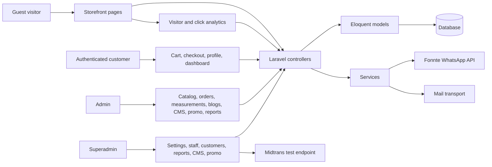
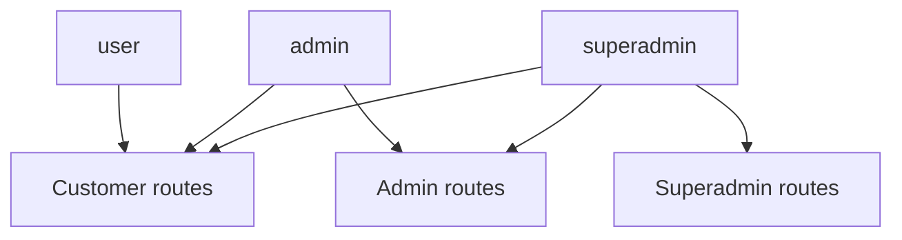
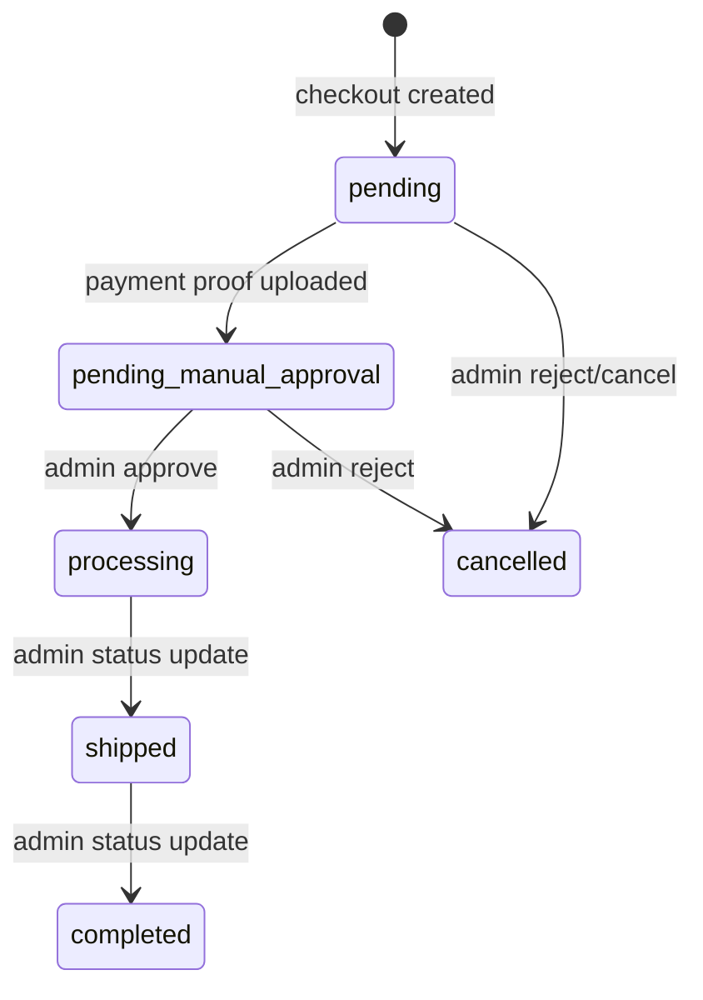

# Diagrams

## System Overview

```mermaid
flowchart LR
    Visitor[Guest visitor] --> Storefront[Storefront pages]
    Storefront --> Analytics[Visitor and click analytics]
    Customer[Authenticated customer] --> CustomerArea[Cart, checkout, profile, dashboard]
    Admin[Admin] --> AdminArea[Catalog, orders, measurements, blogs, CMS, promo, reports]
    Superadmin[Superadmin] --> SuperArea[Settings, staff, customers, reports, CMS, promo]

    Storefront --> Controllers[Laravel controllers]
    Analytics --> Controllers
    CustomerArea --> Controllers
    AdminArea --> Controllers
    SuperArea --> Controllers

    Controllers --> Eloquent[Eloquent models]
    Controllers --> Services[Services]
    Eloquent --> DB[(Database)]
    Services --> WhatsApp[Fonnte WhatsApp API]
    Services --> Mail[Mail transport]
    SuperArea --> Midtrans[Midtrans test endpoint]
```

## Role Access

```mermaid
flowchart TD
    UserRole[user] --> CustomerRoutes[Customer routes]
    AdminRole[admin] --> CustomerRoutes
    AdminRole --> AdminRoutes[Admin routes]
    SuperRole[superadmin] --> CustomerRoutes
    SuperRole --> AdminRoutes
    SuperRole --> SuperRoutes[Superadmin routes]
```

## Order State Flow

```mermaid
stateDiagram-v2
    [*] --> pending: checkout created
    pending --> pending_manual_approval: payment proof uploaded
    pending_manual_approval --> processing: admin approve
    pending_manual_approval --> cancelled: admin reject
    processing --> shipped: admin status update
    shipped --> completed: admin status update
    pending --> cancelled: admin reject/cancel
```
